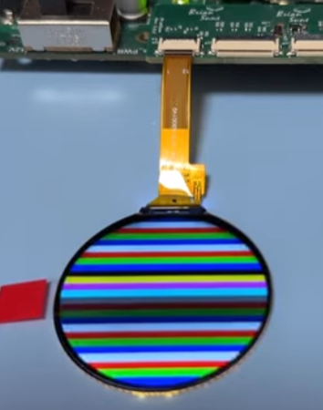
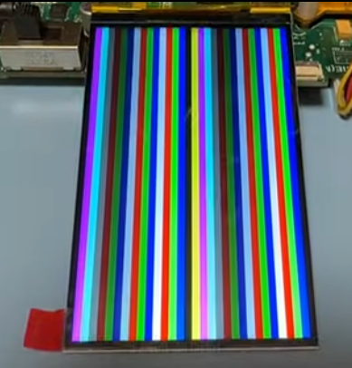
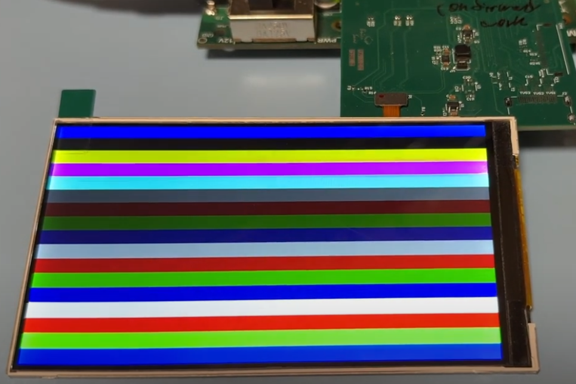
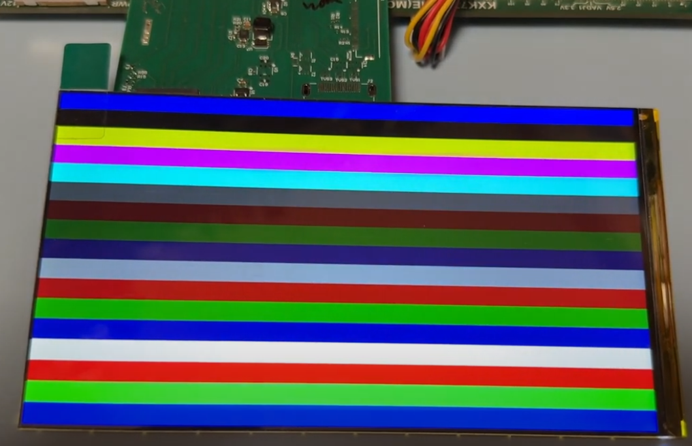

# Possibly the most best Verilog-Based DPI and MIPI-DSI FPGA Examples

## If this project is constructive, welcome to donate a drink to PayPal.

or 

paypal.me/briansune

### This project aimed to support MIPI or DPI I/F off-the-shelf LCD/TFT display.

### Display Examples

|Idx|Display|Status|I/F|Driver IC|Lane #|Mode|Project Link|FPGA|IDE|FPS|W,H,BPP|
|:-:|:-:|:-:|:-:|:-:|:-:|:-:|:-:|:-:|:-:|:-:|:-:|
|  1 |   | 🟢 DONE    | MIPI | ST7797       | 1 | V   | [DT160BQ-C12-01](https://github.com/briansune/Kintex-7-MIPI-DSI-1.6-inch-LCD) | XC7,ZU | Vivado 2020.2 | 60 |   400,400,[16,24] |
|  2 |  | 🟢 DONE    | MIPI | ST7701S      | 2 | V   | [CY300H4003](https://github.com/briansune/Kintex-7-MIPI-DSI-2.95-inch-LCD)    | XC7,ZU | Vivado 2020.2 | 60 |   360,640,[16,24] |
|  3 |  | 🟢 DONE    | MIPI | ST7701S      | 2 | V   | [T397B5-C24-02](https://github.com/briansune/Kintex-7-MIPI-DSI-3.97-inch-LCD) | XC7,ZU | Vivado 2020.2 | 60 |   480,800,[16,24] |
|  4 |   | 🟢 DONE    | MIPI | NT35516      | 2 | V/C | [INX4.5](https://github.com/briansune/Kintex-7-MIPI-DSI-4.5-inch-LCD)         | XC7,ZU | Vivado 2020.2 | 60 |   540,960,[16,24] |
|  5 |   | 🟢 DONE    | MIPI | HX8399C      | 4 | V   | [AML055T012A](https://github.com/briansune/Kintex-7-MIPI-DSI-5.5-inch-LCD)    | XC7,ZU | Vivado 2020.2 | 60 | 1080,1920,[16,24] |
|  6 | Rectangle | 🔜 PENDING | MIPI | ST7701S      | 2 | V   | [HXR397HS25PIN]()                                                             | XC7,ZU | Vivado 2020.2 | 60 |   480,800,[16,24] |
|  7 | Rectangle | 🔜 PENDING | MIPI | R61322       | 4 | V   | [DXQ5D0039]()                                                                 | XC7,ZU | Vivado 2020.2 | 60 | 1080,1920,[16,24] |
|  8 | Circle    | 🔜 PENDING | MIPI | JD9365DA-H3  | 3 | V   | [HD34003C39]()                                                                | XC7,ZU | Vivado 2020.2 | 60 |   800,800,[16,24] |
|  9 | Rectangle | 🔜 PENDING | MIPI | ST7701S      | 2 | V   | [HXR030HSD40PIN]()                                                            | XC7,ZU | Vivado 2020.2 | 60 |   360,640,[16,24] |
| 10 | Rectangle | 🔜 PENDING | MIPI | R63419       | 8 | V   | [LS055R1SX04]()                                                               | XC7,ZU | Vivado 2020.2 | 60 | 1440,2560,[16,24] |
| 11 | Rectangle | 🔜 PENDING | MIPI | NT35950      | 8 | V   | [AML055D105G]()                                                               | XC7,ZU | Vivado 2020.2 | 60 | 2160,3840,[16,24] |
| 12 |     | 🟢 DONE    | DPI  | AT070N92/94  | x | V   | [AT070N92/94](https://github.com/briansune/max-II-cpld-sdram-tft-driver)      | MAX II | Quartus       | 60 |   800,480,24      |
| 13 |  | 🟢 DONE    | DPI  | AT070N92/94  | x | V   | [AT070N92/94](https://github.com/briansune/Spartan_3_sdram_ftf_driver)        | XC3    | ISE 14.7      | 60 |   800,480,24      |